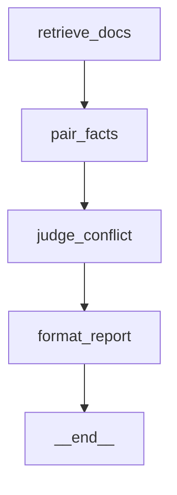

# klerk

> **Document Intelligence Assistant** — production-shaped RAG over a Drive
> corpus with five agentic capabilities, served via FastAPI, evaluated
> against a 20-question rubric. Single-command bring-up via Docker.

Take-home submission for the **Middle AI Engineer** role at
**PT Fata Organa Solusi**. The brief: build a doc-intelligence assistant
for a fictional Indonesian-Japanese tech firm using **only** the
provided Nemotron proxy (`nemotron-3-nano-omni` over a private
Cloudflare-tunneled LiteLLM gateway).

```
                ┌─────────── docker compose up ───────────┐
                │                                          │
                ▼                                          ▼
   FastAPI :8000  ─────── 9 routes ────────▶   Phoenix :6006
        │
        ├── /chat              SSE stream over CRAG-grounded retrieval
        ├── /ingest            Drive (Service Account) or local path
        ├── /sync-status       manifest snapshot
        ├── /actions/extract   action items (capability B)
        ├── /conflicts/scan    LangGraph spine (capability C)
        ├── /draft             multi-drafter writer (capability D)
        ├── /drift/recent      jsonl events (capability E)
        └── /drift/scan        + scheduled nightly via APScheduler
```

## Quick start

```bash
# 1. Fill in credentials (from the Nemotron password-zip)
cp .env.example .env
$EDITOR .env    # LITELLM_KEY, CF_CLIENT_ID, CF_CLIENT_SECRET,
                # GOOGLE_APPLICATION_CREDENTIALS, DRIVE_FOLDER_ID

# 2. Bring everything up (one command per the brief)
docker compose up --build

# 3. Open
#    http://localhost:8000/docs    interactive API
#    http://localhost:6006         Phoenix traces
```

Without Docker (uv directly):

```bash
make setup           # uv sync --extra dev
make api             # uvicorn klerk.api.server:app
make studio          # textual operator TUI
```

## The five agentic capabilities

The brief asks for ≥1 from menu A/B/C; we ship all five plus E:

| ID | Capability | Endpoint | Where |
|----|------------|----------|-------|
| A  | Escalation Drafter — routes a low-confidence question to the right human owner with a structured email draft | inline `/chat` event when confidence < 0.3 | `src/klerk/agent/escalation.py` |
| B  | Action Item Extractor — pulls (assignee, action, due, priority, source_chunk) from a doc or text | `POST /actions/extract` | `src/klerk/agent/action_items.py` |
| C  | Conflict Reporter — cross-doc contradiction sweep through a 4-node LangGraph StateGraph | `POST /conflicts/scan` | `src/klerk/orchestrate/conflict_graph.py` |
| D  | Writer — adversarial multi-drafter doc-writer (Drafter-A + Drafter-B + Adjudicator + Critic), LangGraph fan-out | `POST /draft` · `klerk write` | `src/klerk/agent/writer.py` + `doc_writer.py` + `doc_writer_graph.py` |
| E  | Drift Detector — scheduled corpus diff (doc_added / doc_changed / doc_removed / scope_drift) | `GET /drift/recent` + `POST /drift/scan` | `src/klerk/agent/drift.py` + `src/klerk/scheduled/drift_runner.py` |

Each capability ships an agentskills.io v1 YAML manifest under
`src/klerk/agent/skills/` so any compatible runtime can mount them
through klerk's Python entrypoints.

## Architecture

```
                     ┌────────────────────────┐
                     │   Reviewer's machine   │
                     │   docker compose up    │
                     └───────────┬────────────┘
                                 │
              ┌──────────────────┼─────────────────────┐
              │                  │                     │
      ┌───────▼────────┐  ┌──────▼─────────┐  ┌────────▼──────────┐
      │   api          │  │   phoenix      │  │  gws-mcp (opt-in) │
      │   FastAPI:8000 │  │   :6006        │  │  stdio / http     │
      └───────┬────────┘  └────────────────┘  └───────────────────┘
              │
   ┌──────────┼───────────────────────────────────────────────┐
   │   /chat /ingest /sync-status /health /openapi.json       │
   │   /actions/extract /conflicts/scan /draft /drift/*       │
   │                                                          │
   │   ┌─────────────┐  ┌─────────────┐  ┌──────────────────┐ │
   │   │ drive/sync  │  │ rag/        │  │ agent/           │ │
   │   │ Service Acc │─▶│ chunker     │─▶│  A escalation    │ │
   │   │ + manifest  │  │ embed BGE-M3│  │  B action_items  │ │
   │   │ + changes   │  │ store Lance │  │  C (LangGraph)   │ │
   │   └─────────────┘  │ retrieve    │  │  D writer        │ │
   │                    │ rerank M3-CB│  │  E drift         │ │
   │                    └──────┬──────┘  └──────┬───────────┘ │
   │                           │                │             │
   │                           └────────┬───────┘             │
   │                                    ▼                     │
   │                     ┌─────────────────────────┐          │
   │                     │ llm/router → LiteLLM    │          │
   │                     │ → CF Access (headers)   │          │
   │                     │ → Nemotron proxy        │          │
   │                     │ → nemotron-3-nano-omni  │          │
   │                     └─────────────────────────┘          │
   └──────────────────────────────────────────────────────────┘
```

### LangGraph spine (Conflict Reporter, capability C)



Each node is independently inspectable; the StateGraph carries a
checkpointer hook for resumability. The Mermaid file at
`docs/conflict-graph.mmd` is auto-generated by
`klerk.orchestrate.conflict_graph.export_diagram()` so the diagram
above stays in sync with the actual compiled graph.

## Retrieval pipeline

| Stage | Implementation | What it does |
|-------|----------------|--------------|
| Parser | Docling 2.5+ (PyMuPDF fallback) | Layout-aware extraction with `KLERK_PARSER=pymupdf` escape hatch. |
| Chunker | `src/klerk/rag/chunker.py` (~120 LOC) | Token-aware, tokenizer-pluggable (tiktoken → transformers → char heuristic). |
| Embedder | BGE-M3 dense head via `FlagEmbedding.BGEM3FlagModel` | Multilingual, 1024-d, L2-normalised. Bahasa-strong. |
| Vector store | LanceDB embedded | One process. Hybrid API exposes vector + BM25 in one call. |
| Sparse | Tantivy FTS native to LanceDB | BM25 over the same columns. |
| Fusion | RRF (k=60), ~30 LOC, hand-rolled | Reciprocal Rank Fusion. |
| Rerank | BGE-M3 ColBERT head (MaxSim) | Same model as the embedder; no second model load. ~1GB lighter container than the v4 separate-cross-encoder path. |

See [docs/design-decisions.md](docs/design-decisions.md) §v5-1 and §v5-2
for the reranker collapse and the vision-language embedder evaluation.

## Brief-spec compliance

| Brief constraint                                        | Where        |
|---------------------------------------------------------|--------------|
| Only Nemotron proxy as the LLM (no OpenAI / Anthropic)  | `src/klerk/llm/router.py` + `nemotron.py` |
| FastAPI server with `/chat /ingest /sync-status /health`| `src/klerk/api/server.py` |
| Drive incremental sync (`changes.list` + `pageToken`)   | `src/klerk/drive/sync.py` |
| ≥1 agentic capability from menu A/B/C                   | All five shipped — see capability matrix above |
| 25-30 doc synthetic corpus with the format/locale/contradiction/table/cross-ref constraints | `src/klerk/synth/specs.py`; `klerk synth check` |
| Own 20-Q eval set: 8 factual / 5 multi-hop / 3 conflict / 2 Bahasa / 2 trick | `evaluation_set.json` |
| `docker compose up`                                     | `Dockerfile` + `docker-compose.yml` |
| README, EVAL.md, DATA_GENERATION.md                     | this file + [EVAL.md](EVAL.md) + [DATA_GENERATION.md](DATA_GENERATION.md) |
| "Don't hallucinate; say you don't know" handling        | `/chat` empty-retrieval path; `should_say_dont_know` items in eval (Q19, Q20); confidence-floor escalation |

## Design influences

| Source | What we extracted |
|--------|-------------------|
| Anthropic, *Building Effective Agents* | Single master loop ownership; framework only when the graph shape genuinely benefits. |
| OpenJarvis (design pattern) | Three execution modes — on-demand HTTP / scheduled cron / continuous (Drive `changes.watch` flagged but not shipped). |
| Hermes (single-loop ReAct) | The CRAG-lite loop in `agent/crag.py`. |
| OpenClaw (workflow shape) | The 7-stage doc-writer in `agent/doc_writer.py` (LangGraph spine in `agent/doc_writer_graph.py`). |
| agentskills.io v1 spec | The 5 YAML manifests under `src/klerk/agent/skills/`. |
| LangGraph | Used in **one** place — the Conflict Reporter spine — because it's the only flow where state between LLM calls + per-node tracing + checkpointing all matter together. |

## Eval at a glance

20 questions distributed as 8 factual / 5 multi-hop / 3 conflict /
2 Bahasa / 2 trick. Trick items must trigger an "I don't have that
information" response — hallucinating with any confidence is a fail.
Full methodology, the 5-axis rubric, judge-bias disclosure, and per-Q
table in [EVAL.md](EVAL.md).

```bash
klerk synth check                            # corpus plan satisfies the brief
klerk synth gen                              # generate the 30-doc corpus
klerk index build --src data/synth/fata_organa --rebuild
klerk eval run --ragas --rubric              # → data/output/eval/*.json
```

## Limitations + honest notes

- **CF Access token expiry**: the LiteLLM virtual key is valid for 90
  days from 2026-05-28 — expires ~2026-08-26. Rotation steps in
  `.env.example`.
- **First-time container cold start** fetches ~1.2GB of BGE-M3 weights
  unless the Docker image was built ahead. Multi-stage build pre-bakes
  the weights so subsequent runs are instant.
- **Drive bootstrap** of 25-30 docs runs 60-90s; client polls
  `GET /ingest/runs/{run_id}` to track.
- **LLM-as-judge bias**: the `citation_grounded` and `confidence` axes
  use the same `nemotron-3-nano-omni` that generated the answer —
  absolute scores ~10-15% inflated, per-category deltas reliable. See
  [EVAL.md](EVAL.md) §3.
- **Bahasa coverage** in the corpus is 4/30 docs — meets the ≥3 floor.
  The Nemotron model is multilingual but Bahasa quality on long-tail
  policy language hasn't been independently benchmarked.

## Hardware

| Need | Spec |
|------|------|
| RAM  | ~4GB peak (BGE-M3 fp32 + torch + the API). 8GB recommended. |
| CPU  | Any x86_64 / aarch64 with manylinux wheels. Tested under Linux 6.x. |
| GPU  | Not required. Set `KLERK_EMBED_DEVICE=cuda:0` for an ~8× speed-up on retrieval / rerank if available. |
| Disk | ~3.5GB image (Python + torch + BGE-M3 weights pre-baked) + LanceDB + cache. |
| Network | Outbound HTTPS to the Nemotron proxy (`llm-proxy.atlas-horizon.com`) and Drive API. |

## Repo layout

```
.
├── src/klerk/
│   ├── api/server.py            FastAPI surface (9 routes + middleware)
│   ├── llm/                     LiteLLM + Nemotron + cache
│   ├── drive/sync.py            Service Account incremental sync
│   ├── rag/                     chunker / embed / store / retrieve / rerank
│   ├── agent/                   escalation / action_items / drift / writer
│   ├── agent/skills/            agentskills.io v1 YAML manifests
│   ├── orchestrate/             LangGraph Conflict spine
│   ├── scheduled/drift_runner.py APScheduler nightly drift
│   ├── synth/                   Fata Organa corpus generator
│   ├── eval/                    RAGAS + 5-axis rubric + golden loader
│   ├── studio/                  Textual operator TUI
│   ├── mcp/                     klerk-mcp gateway
│   └── cli/                     Typer verbs
├── tests/                       143 tests, all green
├── evaluation_set.json          The brief's 20-question eval set
├── EVAL.md                      Methodology + rubric + per-Q table
├── DATA_GENERATION.md           Corpus generation methodology
├── HANDOFF.md                   Internal handoff (planning state)
├── docs/                        design-decisions.md + integrations/
├── experimental/                Demoted components (TS shell, KG viz, …)
├── frontend/streamlit_app.py    Deliberate stub — Textual is the chosen UI
├── Dockerfile                   Multi-stage; pre-bakes BGE-M3 weights
├── docker-compose.yml           One-command bring-up
└── pyproject.toml               uv-managed; [scheduled] extra for drift runner
```

## License

MIT. The fictional Fata Organa Solusi spec, the synthetic corpus, and
the evaluation set are purpose-built for this take-home and don't claim
to represent any real organisation.
